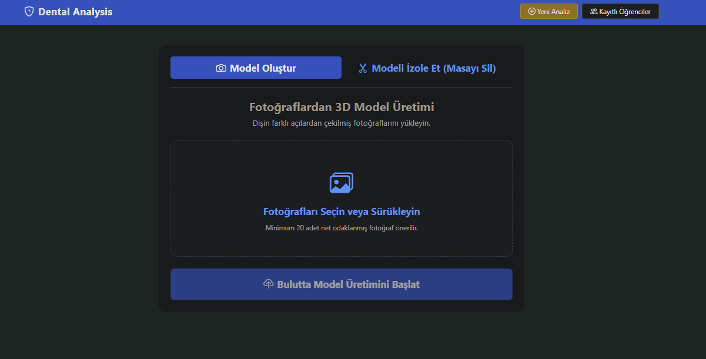
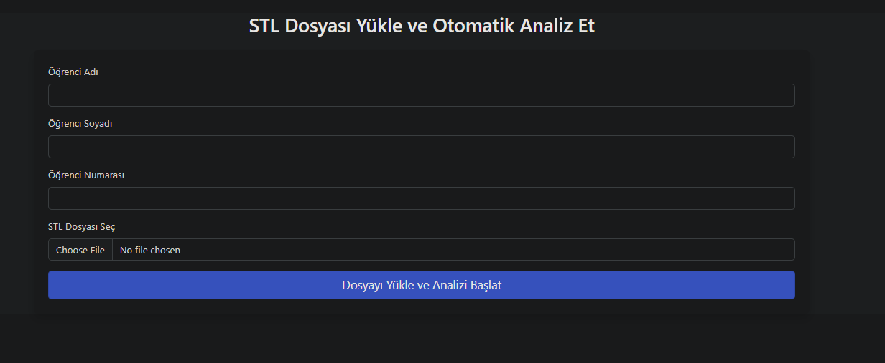
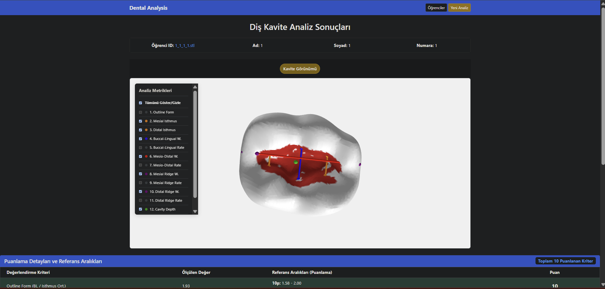
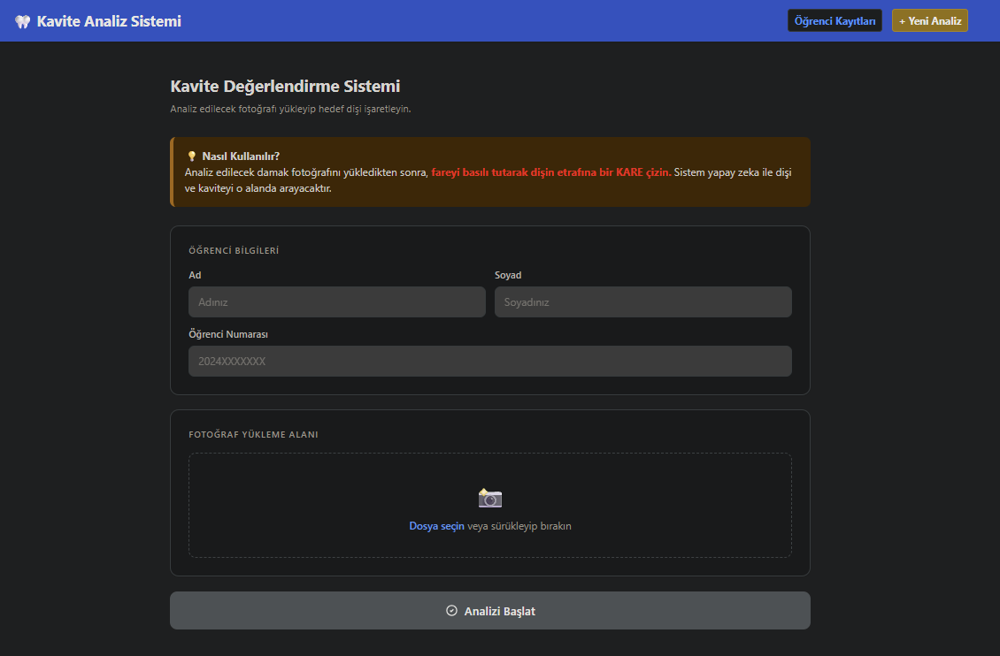
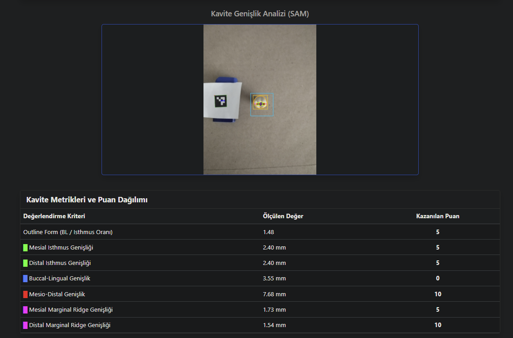
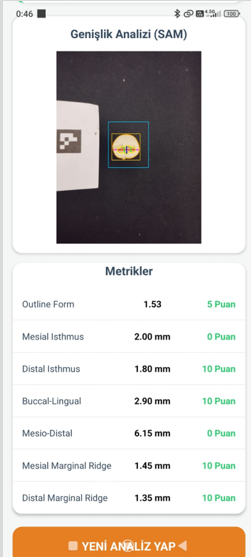

# KavitaAnaliz — Kurulum ve Kullanım Kılavuzu

Repo: `https://github.com/FatihEfeAydogan/KavitaAnaliz`

Bu kılavuz, repodaki 4 alt projeyi (**Bulut_3D_Motoru**, **KaviteAnaliz**, **KaviteMobile**, **KaviteAI_Mobile/KaviteMobile**) içerir.

## İçindekiler
1. [Genel Bakış](#genel-bakış)
2. [Bulut_3D_Motoru](#1-bulut_3d_motoru)
3. [KaviteAnaliz](#2-kaviteanaliz)
4. [KaviteMobile (Flask API)](#3-kavitemobile-flask-api)
5. [KaviteAI_Mobile/KaviteMobile (Mobil Uygulama)](#4-kaviteai_mobilekavitemobile-mobil-uygulama)

---

## Genel Bakış

| Klasör | Teknoloji | Görevi |
|---|---|---|
| Bulut_3D_Motoru | Python / Flask + Open3D + OpenCV + NodeODM (Docker) | Fotoğraflardan 3D nokta bulutu/diş modeli oluşturma ve analiz |
| KaviteAnaliz | Python / Flask + Open3D + scikit-learn | STL diş modeli üzerinden kavite preparasyon analizi |
| KaviteMobile | Python / Flask + PyTorch + Meta SAM | Fotoğraf üzerinden mobil kavite analizi |
| KaviteAI_Mobile/KaviteMobile | React Native (Expo + TypeScript) | Yukarıdaki Flask API'lerine bağlanan mobil istemci |

Üç Python projesi de **MySQL** kullanır (her birinin kendi veritabanı var); mobil istemci ise sadece bir API adresine bağlanır, veritabanı/requirements.txt yerine `package.json` kullanır.

---

## 1. Bulut_3D_Motoru

Fotoğraflardan 3D nokta bulutu/diş modeli oluşturup analiz eden Flask servisi. İki ayrı Flask uygulaması birlikte çalışır: ana servis (`app.py`, port **5000**) ve 3D işleme servisi (`app_3d.py`, port **5001**, NodeODM ile haberleşir).

### Donanım ve Yazılım Gereksinimleri
- Python 3.9 – 3.11
- MySQL Server 8.0+ (veya MariaDB 10.x)
- Docker (NodeODM container'ı için)
- En az 8 GB RAM, 5 GB boş disk
- Windows / macOS / Linux

### Kullanılan Kütüphaneler
| Kütüphane | Ne için |
|---|---|
| Flask | Web sunucusu/API |
| requests | İç servisler ve NodeODM API çağrıları |
| open3d | 3D mesh/point cloud işleme |
| opencv-python | Görüntü işleme |
| numpy | Sayısal işlemler |
| scipy | Delaunay üçgenleme |
| mysql-connector-python | MySQL bağlantısı |


### Kurulum
```bash
git clone https://github.com/FatihEfeAydogan/KavitaAnaliz.git
cd KavitaAnaliz/Bulut_3D_Motoru
python -m venv venv
# Windows: venv\Scripts\activate   |  Mac/Linux: source venv/bin/activate
pip install -r requirements.txt
```

### NodeODM Kurulumu (zorunlu)
```bash
docker run -p 3000:3000 opendronemap/nodeodm
```

### Veritabanı Kurulumu
Veritabanı adı: `model_dentistry_db`
```bash
mysql -u root -p < init.sql
```
Bağlantı bilgisi `database.py` içinde (`host`, `user`, `password`, `database`) — kendi MySQL şifreniz farklıysa güncelleyin.

> Not: Klasördeki `analyses.db` (SQLite) dosyası kullanılmıyor, eski/test kalıntısı — silinebilir.

### Çalıştırma
```bash
python app.py
```
→ `http://127.0.0.1:5000` (app_3d.py port 5001'i otomatik başlatır)

### Örnek Veri
`static/uploads/` klasöründe önceden işlenmiş örnek modeller (`uploaded_model.obj`, `isolated_tooth.stl`).

### Demo Kullanıcı Bilgileri
Giriş/kimlik doğrulama sistemi yok. Sadece MySQL bağlantı bilgisi var.

### Klasör Yapısı
```
Bulut_3D_Motoru/
├── app.py              # Ana Flask servisi (port 5000)
├── app_3d.py            # NodeODM ile haberleşen 3D işleme servisi (port 5001)
├── database.py          # MySQL bağlantı ve CRUD fonksiyonları
├── process_model.py      # Open3D ile mesh/diş izolasyonu işlemleri
├── init.sql              # Veritabanı şema dosyası
├── requirements.txt       # Python bağımlılıkları
├── templates/              # HTML şablonları
└── static/
    ├── uploads/            # Yüklenen/üretilen modeller
    └── models/              # NodeODM çıktıları (nokta bulutu)
```

### 📸 Ekran Görüntüleri
 


---

## 2. KaviteAnaliz

STL formatındaki diş modelleri üzerinden kavite preparasyonu analizi yapan Flask web uygulaması.

### Donanım ve Yazılım Gereksinimleri
- Python 3.9 – 3.11
- MySQL Server 8.0+
- En az 8 GB RAM, 2 GB boş disk

### Kullanılan Kütüphaneler (repodaki `requirements.txt`)
| Kütüphane | Ne için |
|---|---|
| Flask | Web sunucusu/API |
| mysql-connector-python | MySQL bağlantısı |
| open3d | STL okuma, hizalama, kırpma, ölçüm |
| numpy | Sayısal işlemler |
| scikit-learn | DBSCAN (kümeleme), PCA (hizalama) |
| scipy | KDTree, ConvexHull |
| Werkzeug | Güvenli dosya adlandırma |

### Kurulum
```bash
git clone https://github.com/FatihEfeAydogan/KavitaAnaliz.git
cd KavitaAnaliz/KaviteAnaliz
python -m venv venv
# Windows: venv\Scripts\activate   |  Mac/Linux: source venv/bin/activate
pip install -r requirements.txt
```

### Veritabanı Kurulumu
Veritabanı adı: `dentalanalysis`
```bash
mysql -u root -p < init.sql
# veya
python setup_db.py
```
Oluşan tablolar: `student_list` (öğrenci + STL dosya yolları), `cavity_scores` (ölçümler + puanlar, foreign key ile bağlı).

### Çalıştırma
```bash
python app.py
```
→ `http://127.0.0.1:5000`

### Örnek Veri
`stl-tek/` klasöründe **10 örnek STL diş modeli** (`1a-Tek.stl` … `10a-tek.stl`).

### Demo Kullanıcı Bilgileri
Login sistemi yok. Önceden tanımlı demo kullanıcı yok; öğrenci kaydı form üzerinden girilir.

### Klasör Yapısı
```
KaviteAnaliz/
├── app.py
├── analysis.py          # Ana analiz algoritması
├── cavity_utils.py       # Kavite derinliği / convex hull hesaplama
├── cut_model.py          # Mesh alt kırpma
├── rotate.py             # Hizalama (alignment)
├── vertex_count.py        # Vertex sayım yardımcı betiği
├── setup_db.py            # init.sql çalıştırma betiği
├── init.sql               # Veritabanı şema dosyası
├── requirements.txt
├── templates/
└── stl-tek/               # 10 örnek STL diş modeli
```

### 📸 Ekran Görüntüleri

 

---

## 3. KaviteMobile (Flask API)

Mobil uygulamadan gönderilen diş fotoğrafları üzerinde Meta'nın **Segment Anything (SAM)** modeli ile segmentasyon yapan Flask API. (Mobil istemci için bkz. bölüm 4.)

### Donanım ve Yazılım Gereksinimleri
- Python 3.9 – 3.11
- MySQL Server 8.0+
- PyTorch çalışır: en az 8 GB RAM; GPU yoksa CPU üzerinde çalışır (daha yavaş)
- ~2-3 GB boş disk (SAM model dosyası ~375 MB)

### Kullanılan Kütüphaneler
| Kütüphane | Ne için |
|---|---|
| Flask | Web sunucusu/API |
| flask-cors | Mobil istemciden gelen CORS istekleri |
| mysql-connector-python | MySQL bağlantısı |
| opencv-python | Görüntü işleme |
| numpy | Sayısal işlemler |
| torch | SAM modeli için (PyTorch) |
| segment-anything | Meta'nın segmentasyon modeli |
| trimesh | STL dışa aktarma |
| Werkzeug | Güvenli dosya adlandırma |

### Kurulum
```bash
git clone https://github.com/FatihEfeAydogan/KavitaAnaliz.git
cd KavitaAnaliz/KaviteMobile
python -m venv venv
# Windows: venv\Scripts\activate   |  Mac/Linux: source venv/bin/activate
pip install -r requirements.txt
```

### SAM Model Dosyasını İndirin (zorunlu — repoda yok)
```bash
curl -L -o sam_vit_b_01ec64.pth https://dl.fbaipublicfiles.com/segment_anything/sam_vit_b_01ec64.pth
```

### Veritabanı Kurulumu
Veritabanı adı: `kavite_mobile_db`. `database.py` içindeki `init_db()` fonksiyonu uygulama ilk çalıştığında veritabanını ve `kavite_sonuclar` tablosunu **otomatik** oluşturur. Bağlantı bilgisi `DB_CONFIG` içinde — kendi şifreniz farklıysa güncelleyin.


### Çalıştırma
```bash
python app.py
```
→ `http://0.0.0.0:5000` (fiziksel telefondan erişim için bilgisayarın yerel ağ IP'sini kullanın, örn. `http://192.168.x.x:5000`)

### Örnek Veri
`static/uploads/` klasöründe örnek diş fotoğrafları ve `static/uploads/drawn/` klasöründe bunlardan üretilmiş örnek STL dosyaları.

### Demo Kullanıcı Bilgileri
Giriş sistemi yok. Sadece MySQL bağlantı bilgisi var.

### Klasör Yapısı
```
KaviteMobile/
├── app.py
├── analysis.py            # SAM tabanlı görüntü analizi
├── database.py             # MySQL bağlantı + otomatik tablo kurulumu
├── stl_exporter.py          # trimesh ile STL dışa aktarma
├── sam_vit_b_01ec64.pth      # (elle indirilmeli, repoda yok)
├── requirements.txt
├── templates/
└── static/
    └── uploads/
        └── drawn/             # İşaretlenmiş görseller + STL
```

### 📸 Ekran Görüntüleri



---

## 4. KaviteAI_Mobile/KaviteMobile (Mobil Uygulama)

`KaviteMobile` (Flask API) backend'ine bağlanan **Expo / React Native** mobil istemci. Python kullanmaz; `requirements.txt` yerine `package.json`, veritabanı yerine sadece bir API adresi yapılandırması vardır.

### Donanım ve Yazılım Gereksinimleri
- Node.js 18 LTS veya üzeri + npm
- Expo CLI (npx ile otomatik gelir)
- Test için: Expo Go (Android/iOS) veya Android Studio / Xcode
- Backend'e aynı yerel ağdan erişim
- En az 4 GB RAM, ~500 MB disk (node_modules)

### Kullanılan Kütüphaneler (`package.json`)
| Kütüphane | Ne için |
|---|---|
| expo (~54) | Uygulama çatısı |
| react / react-native | Temel UI çatısı |
| expo-router | Dosya tabanlı sayfa yönlendirme |
| expo-image-picker | Kameradan/galeriden fotoğraf seçme |
| axios | Backend ile HTTP iletişimi |
| @react-navigation/* | Sekme/gezinme menüleri |
| typescript, eslint (dev) | Tip kontrolü, kod kalitesi |

### Kurulum
```bash
git clone https://github.com/FatihEfeAydogan/KavitaAnaliz.git
cd KavitaAnaliz/KaviteAI_Mobile/KaviteMobile
npm install
```

### Backend Adresini Ayarlama
Veritabanı yoktur; bunun yerine Flask API adresinin doğru girilmesi gerekir. `axios` ile istek yapılan dosyada `BASE_URL` değerini güncelleyin:
- Emülatör/simülatör: `http://127.0.0.1:5000`
- Gerçek telefon: bilgisayarın yerel ağ IP'si, örn. `http://192.168.1.X:5000`

### Çalıştırma
```bash
npx expo start
```
QR kodu Expo Go ile okutun, veya terminalde `a` (Android) / `i` (iOS).

### Örnek Veri
Kendi içinde örnek veri yok; backend'in `static/uploads/` klasöründeki fotoğraflar veya kendi telefon kameranız kullanılabilir.

### Demo Kullanıcı Bilgileri
Giriş/kayıt ekranı yok.

### Klasör Yapısı
```
KaviteAI_Mobile/KaviteMobile/
├── App.js
├── app.json / tsconfig.json
├── package.json
├── components/
├── constants/
├── hooks/
├── assets/images/
└── scripts/
```

### 📸 Ekran Görüntüleri

---


